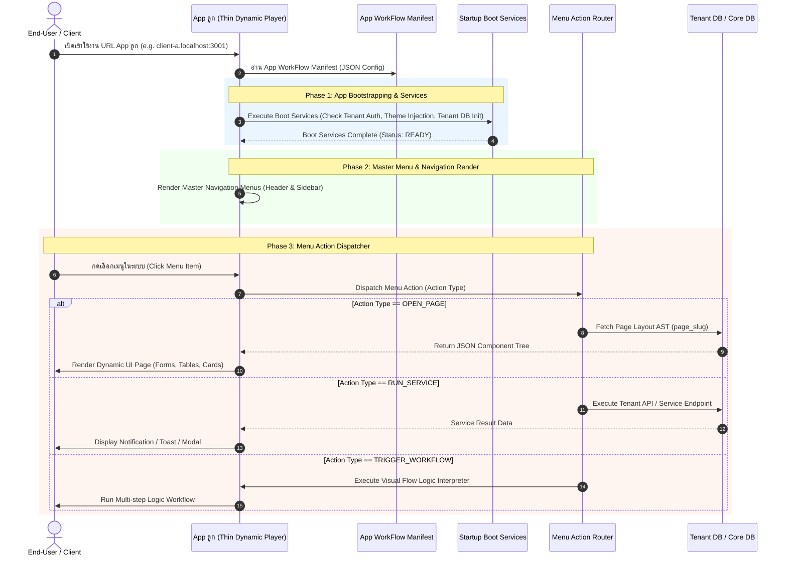

# 📱 สถาปัตยกรรมระดับบนสุดของ App ลูก (AppWorkFlow.MD)

> **เป้าหมาย:** สถาปัตยกรรมระบบควบคุม **App WorkFlow (Master App Manifest)** สำหรับ **App ลูก (Child Application Container)**  
> **หลักการสำคัญ:** App WorkFlow อยู่ในระดับที่ใหญ่กว่า **Page Layouts** และ **Visual Flow Logic** โดยทำหน้าที่เป็นศูนย์กลางของ App ลูกในการตัดสินใจว่า:  
> 1. เมื่อเปิดเข้า App ลูก ต้องเรียก **Service / Init Bootstrapping** อะไรบ้าง  
> 2. App ลูกนี้มีโครงสร้าง **Master Navigation Menus** อะไรบ้าง  
> 3. เมื่อผู้ใช้งานคลิกเมนู จะทำการ **เปิด Page ไหน (`OPEN_PAGE`)**, **เรียก Service ไหน (`RUN_SERVICE`)**, หรือ **รัน Workflow ไหน (`TRIGGER_WORKFLOW`)**  
> **เอกสารประกอบ:** ใช้ควบคู่กับ [PlanOverView.MD](file:///c:/code/lowcode/PlanOverView.MD), [DesignStudio.MD](file:///c:/code/lowcode/DesignStudio.MD) และ [PlatformModule.MD](file:///c:/code/lowcode/PlatformModule.MD)

---

## 🏗️ 1. ลำดับสถาปัตยกรรม (Architectural Hierarchy)

```
┌─────────────────────────────────────────────────────────────────────────────────────────────┐
|                               [ 📱 App WorkFlow / App Manifest ]                            |
|                                     (Top-Level App Container)                               |
|                                                                                             |
|  1. App Bootstrapping & Services (Session Check, Tenant DB Connection, CSS Theme Injection) |
|  2. Master Navigation Menu Architecture (Top Nav, Sidebar Drawer, Badges, Roles)            |
|  3. Menu Action Router & Event Dispatcher:                                                   |
|     - Click Menu ──> [OPEN_PAGE] ──> Render Dynamic Page Layout AST (e.g. index.page)       |
|     - Click Menu ──> [RUN_SERVICE] ──> Invoke Backend Service (e.g. POST /api/v1/export)    |
|     - Click Menu ──> [TRIGGER_WORKFLOW] ──> Execute React Flow Logic (e.g. LeadSubmitFlow)  |
└─────────────────────────────────────────────────────────────────────────────────────────────┘
                                               │
                        ┌──────────────────────┴──────────────────────┐
                        ▼                                             ▼
            ┌───────────────────────┐                     ┌───────────────────────┐
            |  🎨 Page Layouts AST  |                     | ⚡ WorkFlow Logic AST |
            |  (Form, Table, Cards) |                     | (React Flow Nodes)    |
            └───────────────────────┘                     └───────────────────────┘
```

---

## ⚡ 2. วงจรการทำงานเมื่อ End-User เข้าใช้งาน App ลูก (Child App Lifecycle)



---

## 💾 3. โครงสร้าง JSON Schema ของ App WorkFlow Manifest (`AppWorkFlowManifest`)

ข้อมูล App WorkFlow ของแต่ละ App ลูกจะถูกจัดเก็บลงตาราง `app_workflows` หรือฟิลด์ `workflow_manifest` ใน Supabase Core DB ดังนี้:

```json
{
  "app_id": "a0000000-0000-0000-0000-000000000001",
  "app_slug": "client-a",
  "app_name": "Siam Enterprise Portal",
  "version": "1.2.0",
  "boot_services": [
    {
      "id": "service_auth_check",
      "service_name": "Tenant Auth Session Validation",
      "type": "AUTH_CHECK",
      "required": true
    },
    {
      "id": "service_theme_injector",
      "service_name": "Dynamic CSS Theme Injection",
      "type": "THEME_INJECT",
      "preset": "modern-indigo"
    },
    {
      "id": "service_tenant_db",
      "service_name": "Connect Tenant DB",
      "type": "DB_CONNECT",
      "tenant_db_name": "app_db_client_a"
    }
  ],
  "master_navigation": [
    {
      "id": "menu_home",
      "label": "Home Dashboard",
      "icon": "Home",
      "roles": ["admin", "member"],
      "action": {
        "type": "OPEN_PAGE",
        "target_page_slug": "index"
      }
    },
    {
      "id": "menu_services",
      "label": "Client Services",
      "icon": "Box",
      "roles": ["admin", "member"],
      "action": {
        "type": "OPEN_PAGE",
        "target_page_slug": "services"
      }
    },
    {
      "id": "menu_sync_data",
      "label": "Sync Tenant Data",
      "icon": "RefreshCw",
      "roles": ["admin"],
      "action": {
        "type": "RUN_SERVICE",
        "service_endpoint": "/api/v1/tenant/sync-data",
        "http_method": "POST"
      }
    },
    {
      "id": "menu_onboard_flow",
      "label": "Run Onboarding Wizard",
      "icon": "Workflow",
      "roles": ["admin", "member"],
      "action": {
        "type": "TRIGGER_WORKFLOW",
        "workflow_tree_id": "wf_client_onboarding"
      }
    }
  ]
}
```

---

## 🎯 4. ชนิดของ Menu Action Handlers

| ชนิด Action (`action.type`) | คำอธิบาย | พารามิเตอร์ที่ต้องการ | ผลลัพธ์ |
|---|---|---|---|
| 📄 `OPEN_PAGE` | โหลดและวาด UI หน้าเว็บจาก JSON AST | `target_page_slug` | เปลี่ยนหน้าจอ UI สดใน App ลูก |
| 🔌 `RUN_SERVICE` | ยิง API / รันคำสั่ง Service หลังบ้าน | `service_endpoint`, `http_method` | ประมวลผลข้อมูล และแสดงแจ้งเตือน |
| ⚡ `TRIGGER_WORKFLOW` | เรียกตัวตีความ Flow Logic (React Flow Engine) | `workflow_tree_id` | รันกระบวนการหลายขั้นตอน (Multi-step Logic) |

---

## 🛠️ 5. การผนวกเข้ากับ DevStudio (`/studio`)

ใน **DevStudio (`/studio`)** จะมีแถบมอดูล **App WorkFlow Designer ([AppWorkflowDesigner.tsx](file:///c:/code/lowcode/src/components/studio/AppWorkflowDesigner.tsx))** สำหรับตั้งค่า:
1. **Boot Services Manager:** เพิ่ม/ลบ/แก้ไข Service ลำดับแรกเมื่อเปิด App
2. **Master Navigation Menu Editor:** ลากและกำหนดชื่อเมนู, ไอคอน, สิทธิ์ สตรีมการกระทำเมื่อกดเมนู
3. **Action Dispatcher Binding:** เลือกประเภท Action เมื่อกดเมนู (`OPEN_PAGE`, `RUN_SERVICE`, `TRIGGER_WORKFLOW`)
