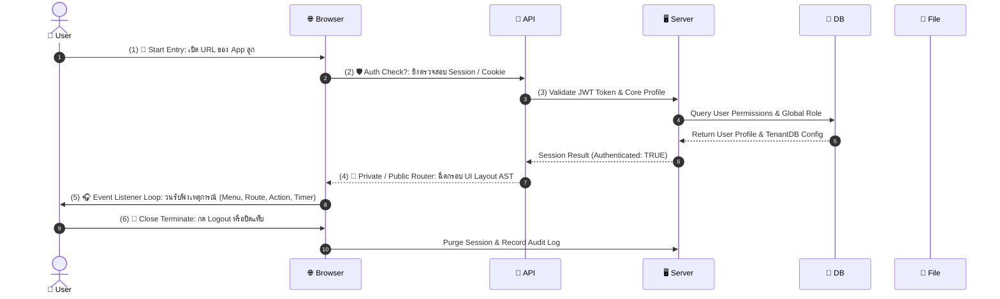

# 🎬 สถาปัตยกรรมลำดับการทำงานตั้งต้นแบบ Sequence Diagram (DefaultFlow.MD)

> **เป้าหมาย:** สถาปัตยกรรมลำดับขั้นตอนตั้งต้น (Default Sequence Master Lifecycle Flow) สำหรับ Visual Sequence Diagram Studio ใน **Flow Studio (`/flow-studio`)**  
> **หลักการสำคัญ:** แสดงผลวงจรชีวิตแอปพลิเคชันผ่านผัง **Sequence Diagram** โดยแบ่งแนวคอลัมน์ (Lifelines / Participants) ออกเป็น 6 เสาหลัก:  
> 1. 👤 **User** (ผู้ใช้งาน)  
> 2. 🌐 **Browser** (เว็บเบราว์เซอร์ App ลูก)  
> 3. 🔌 **API** (เกตเวย์การสื่อสาร API Endpoint)  
> 4. 🖥️ **Server** (เซิร์ฟเวอร์ประมวลผล App แม่/ลูก)  
> 5. 💾 **DB** (ฐานข้อมูล Tenant DB & Core DB)  
> 6. 📁 **File** (ที่เก็บไฟล์และสื่อมีเดีย)  
> **เอกสารประกอบ:** ใช้ควบคู่กับ [EnterpriseFlow.MD](file:///c:/code/lowcode/EnterpriseFlow.MD), [AppWorkFlow.MD](file:///c:/code/lowcode/AppWorkFlow.MD) และ [DesignStudio.MD](file:///c:/code/lowcode/DesignStudio.MD)

---

## 🏗️ 1. ลำดับ Sequence Diagram ตั้งต้น (Default Sequence Flow)

เมื่อเปิดใช้งาน **Flow Studio (`/flow-studio`)** ครั้งแรก ตัวระบบจะสร้างผัง Sequence Diagram ตั้งต้นขึ้นมาบน 6 Lifelines อัตโนมัติ:



---

## 📐 2. คอลัมน์ 6 Lifelines (Participant Headers)

| คอลัมน์ Lifeline | สัญลักษณ์ | X-Position | คำอธิบายหน้าที่ |
|---|---|---|---|
| 1. 👤 **User** | User | `100px` | แอ็กชันฝั่งผู้ใช้งาน (การคลิก, การพิมพ์, การปิดหน้าจอ) |
| 2. 🌐 **Browser** | Browser | `340px` | ไคลเอนต์เบราว์เซอร์ App ลูก (วาด UI, เก็บ State, รัน Event Loop) |
| 3. 🔌 **API** | API | `580px` | HTTP API Endpoints & Request/Response Router |
| 4. 🖥️ **Server** | Server | `820px` | Engine ประมวลผล Business Logic ในเซิร์ฟเวอร์ |
| 5. 💾 **DB** | DB | `1060px` | ฐานข้อมูล Core DB และ Tenant DB PostgreSQL |
| 6. 📁 **File** | File | `1300px` | ระบบจัดการไฟล์ อัปโหลด/ดาวน์โหลด สื่อมีเดีย |

---

## 🧩 3. การเพิ่มและแก้ไข Sequence Step Nodes (Add & Edit Steps)

ผู้ใช้งานสามารถเพิ่ม (Add Step) และแก้ไข (Edit Step) Node ข้อความส่งผ่านบน Lifelines ได้อย่างอิสระ:

### 3.1 ประเภทลูกศรข้อความ (Message Arrow Types):
- ➡️ **Request Arrow (`request`):** คำขอร้องขอข้อมูลจากฝั่งซ้ายไปฝั่งขวา (สีน้ำเงิน)
- ⬅️ **Response Arrow (`response`):** การตอบกลับข้อมูลจากฝั่งขวาย้อนกลับฝั่งซ้าย (สีเขียว)
- 🔀 **Async Arrow (`async`):** การส่งข้อมูลแบบไม่รอผลตอบกลับ (สีส้ม)
- ❓ **Decision Arrow (`decision`):** เงื่อนไขการตัดสินใจแยกสาขา Yes/No (สีม่วง)

---

## 💾 4. โครงสร้าง JSON Schema ของ Sequence Diagram (`SequenceWorkflowAST`)

```json
{
  "flow_name": "Default Master Sequence Flow",
  "version": "1.0.0",
  "lifelines": ["user", "browser", "api", "server", "db", "file"],
  "nodes": [
    {
      "id": "seq_step_1",
      "type": "sequenceStepNode",
      "position": { "x": 100, "y": 150 },
      "data": {
        "stepNumber": 1,
        "label": "🚀 Start Entry: Request App URL",
        "sourceLifeline": "user",
        "targetLifeline": "browser",
        "messageType": "request"
      }
    },
    {
      "id": "seq_step_2",
      "type": "sequenceStepNode",
      "position": { "x": 340, "y": 230 },
      "data": {
        "stepNumber": 2,
        "label": "🛡️ Auth Check?: Validate Session Cookie",
        "sourceLifeline": "browser",
        "targetLifeline": "api",
        "messageType": "request"
      }
    },
    {
      "id": "seq_step_3",
      "type": "sequenceStepNode",
      "position": { "x": 580, "y": 310 },
      "data": {
        "stepNumber": 3,
        "label": "Query Core DB & Profile Data",
        "sourceLifeline": "api",
        "targetLifeline": "db",
        "messageType": "request"
      }
    },
    {
      "id": "seq_step_4",
      "type": "sequenceStepNode",
      "position": { "x": 340, "y": 390 },
      "data": {
        "stepNumber": 4,
        "label": "🔐 Private / Public Router: Load Page AST",
        "sourceLifeline": "api",
        "targetLifeline": "browser",
        "messageType": "response"
      }
    },
    {
      "id": "seq_step_5",
      "type": "sequenceStepNode",
      "position": { "x": 340, "y": 470 },
      "data": {
        "stepNumber": 5,
        "label": "🎧 Event Listener Loop: Active",
        "sourceLifeline": "browser",
        "targetLifeline": "browser",
        "messageType": "async"
      }
    },
    {
      "id": "seq_step_6",
      "type": "sequenceStepNode",
      "position": { "x": 100, "y": 550 },
      "data": {
        "stepNumber": 6,
        "label": "🛑 Close Terminate: Logout Session",
        "sourceLifeline": "user",
        "targetLifeline": "server",
        "messageType": "request"
      }
    }
  ]
}
```
