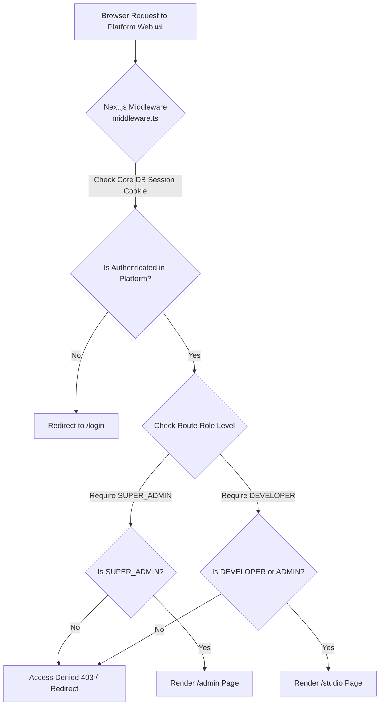

# 🔐 รายละเอียดการออกแบบระบบ User + Auth & UI Admin Page (DeveloperAdminPage.MD)

> **เป้าหมาย:** สถาปัตยกรรมระบบยืนยันตัวตน (Authentication), สิทธิ์การใช้งาน (Authorization / RBAC) และระบบบริหารจัดการหลังบ้าน (UI Admin Page) สำหรับ **App แม่ (Platform Control Studio)**  
> **คำเตือนสถาปัตยกรรมสำคัญ:** ระบบ User + Auth ของ **App แม่** และ **App ลูก** แยกขาดจากกันโดยสิ้นเชิงทั้งในระดับ **Database**, **Session Token** และ **User Profiles**  
> **เอกสารประกอบ:** ใช้ควบคู่กับ [PlanOverView.MD](file:///c:/code/lowcode/PlanOverView.MD) และ [StackDiffenning.MD](file:///c:/code/lowcode/StackDiffenning.MD)

---

## ⚡ 0. ข้อแตกต่างที่เด็ดขาดระหว่าง Auth Web แม่ VS Auth App ลูก (Platform Auth vs Tenant Auth)

```
┌─────────────────────────────────────────────────────────────────────────────────────────────┐
|                                    [ 🏢 Web แม่ (Platform Studio) ]                          |
|  - Database: Core DB (Supabase public schema)                                               |
|  - Auth Engine: Supabase Auth (auth.users + public.profiles)                                |
|  - Users: Super Admin, Low-Code Developer, Studio Designer                                  |
|  - Goal: ล็อกอินเพื่อออกแบบ UI (Studio), วาด Flow, สลับธีม, Provision App และควบคุมหลังบ้าน       |
└─────────────────────────────────────────────────────────────────────────────────────────────┘
                                               │
                                 แยกขาดจากกันคนละ Database & Engine
                                               │
                                               ▼
┌─────────────────────────────────────────────────────────────────────────────────────────────┐
|                                    [ 📱 App ลูก (Thin Dynamic Player) ]                      |
|  - Database: Tenant DB แยกอิสระ (e.g. app_db_client_a, app_db_client_b)                     |
|  - Auth Engine: Business Auth ใน Tenant DB (e.g. users, members, custom JWT)                |
|  - Users: ลูกค้า, พนักงาน, หรือ End-Users ขององค์กรที่ใช้งาน App ลูกนั้นๆ                         |
|  - Goal: ล็อกอินใช้งาน Business Workflow จริงในระบบ App ลูก (ไม่สามารถข้ามมาเว็บแม่ได้)          |
└─────────────────────────────────────────────────────────────────────────────────────────────┘
```

| คุณสมบัติ | 🏢 Auth ของ Web แม่ (Platform Auth) | 📱 Auth ของ App ลูก (Tenant Auth) |
|---|---|---|
| **ขอบเขตการใช้งาน** | เว็บแม่ (`/admin`, `/studio`, `/flow-studio`) | หน้ารันจริงของ App ลูก (`/app/[appSlug]` หรือ Subdomain) |
| **ฐานข้อมูล (Database)** | **Core DB** (Supabase Main DB) | **Tenant DB ส่วนตัว** (เช่น `app_db_client_a`) |
| **ผู้ใช้งานหลัก** | Super Admins, Low-Code Developers, Testers | End-Users, ลูกค้า, พนักงานประจำ App นั้นๆ |
| **บทบาทสิทธิ์ (Roles)** | `SUPER_ADMIN`, `DEVELOPER`, `VIEWER` | ตาม Schema Business ของ App ลูก (เช่น `admin`, `member`, `guest`) |
| **การจัดการ Session** | Cookies & JWT ผ่าน Supabase Auth SSR | Local JWT / Tenant Cookie Isolation |

*เอกสารฉบับนี้จะลงลึกเฉพาะ **ระบบ User + Auth ของ Web แม่ และ UI Admin Page** เป็นลำดับแรก*

---

## 📌 1. วัตถุประสงค์และขอบเขต (Objectives & Scope)

ในการพัฒนาเว็บแม่ (Studio / DesignMode Engine) สำหรับจัดการ Low-Code Application จำเป็นต้องมีระบบความปลอดภัยและหน้าจอ Admin สำหรับควบคุมผู้ใช้งานและสิทธิ์อย่างรัดกุม โดยประกอบด้วย 3 ส่วนหลัก:

1. **ระบบ Authenticated Session สำหรับ App แม่ (Studio & Admin):**
   - ป้องกันการเข้าถึง Route สำคัญ เช่น `/studio`, `/flow-studio`, `/admin/*`, `/audit-logs` จากผู้ใช้งานที่ไม่ได้รับอนุญาต
   - รองรับ Login/Logout, Session Persistence, Refresh Token ผ่าน **Supabase Auth SSR** ทำงานสอดคล้องกับ **Next.js 15 (App Router Middleware)**

2. **ระบบสิทธิ์การใช้งาน (Role-Based Access Control - RBAC & Multi-Tenant Membership):**
   - **Global Platform Roles (สิทธิ์ระดับระบบแม่):**
     - 🔴 `SUPER_ADMIN`: สิทธิ์สูงสุด บริหารจัดการผู้ใช้งานทั้งหมด, สร้าง App ลูกใหม่, กำหนดค่า Server & Database, ดู Audit Logs ทั้งระบบ
     - 🔵 `DEVELOPER`: สิทธิ์สร้างและแก้ไข Layout หน้าเว็บ (Studio), สร้าง Flow Logic (Flow Studio), สลับและปรับแต่งธีมใน App ที่ได้รับมอบหมาย
     - ⚪ `VIEWER`: สิทธิ์เข้าดูตัวอย่างหน้าเว็บ (Preview Mode) และดู Log ในลักษณะอ่านอย่างเดียว (Read-Only)
   - **App-Level Roles (สิทธิ์เจาะจงราย App ลูกเพื่ออนุญาตเข้า Studio):**
     - 👑 `APP_OWNER`: ผู้ดูแลหลักประจำ App ลูกนั้นๆ ที่มีสิทธิ์แก้ไขการตั้งค่า App ใน Studio
     - ✍️ `APP_EDITOR`: สิทธิ์ปรับแต่ง UI/Flow ของ App ลูกนั้นๆ ใน Studio
     - 👁️ `APP_VIEWER`: สิทธิ์รันและทดสอบพรีวิว App ลูก

3. **UI Admin Page (ศูนย์ควบคุม App แม่ `/admin`):**
   - **Dashboard Overview:** สรุปเมตริกสำคัญ (จำนวน App, Active Users ของเว็บแม่, สถิติการใช้งาน, กิจกรรมล่าสุด)
   - **User Management Panel:** บริหารผู้ใช้งานเว็บแม่ (สร้างผู้ใช้ใหม่, แก้ไข Role, ระงับบัญชี, รีเซ็ตรหัสผ่าน)
   - **App Membership Management:** มอบหมายสิทธิ์ให้ Developer คนไหนเข้าแก้ไข App ลูกตัวไหนใน Studio ได้บ้าง
   - **Security & Row Level Security (RLS) Control:** กำหนดนโยบายความปลอดภัยฐานข้อมูล Core DB PostgreSQL

---

## 🏗️ 2. สถาปัตยกรรมระบบ Auth ของ Web แม่ (Authentication & Route Protection)

ระบบ Auth ของเว็บแม่ทำงานบน **Supabase Auth Engine (Core DB)** ร่วมกับ **Next.js 15 Middleware** บน Edge Level เพื่อตรวจความถูกต้องของ JWT Token และ Cookies ก่อนส่ง Request เข้าสู่ Server Components ของ App แม่



### 2.1 Next.js 15 App Router + Supabase SSR Architecture
- **Supabase SSR SDK (`@supabase/ssr`):** ใช้จัดการ Cookie-based Authentication ของ Core DB
- **Helper Utilities:**
  1. `src/lib/supabase/client.ts`: Supabase Client สำหรับ Client Components ของ App แม่ (`createBrowserClient`)
  2. `src/lib/supabase/server.ts`: Supabase Client สำหรับ Server Components & Server Actions (`createServerClient`)
  3. `src/middleware.ts`: Global Middleware อัปเดต Auth Session ของ App แม่ และบล็อก Unauthenticated Routes

---

## 💾 3. การขยาย Database Schema ใน Supabase Core DB

เพื่อรองรับโปรไฟล์ผู้ใช้ของเว็บแม่ และการผูกสิทธิ์ Developer เข้ากับ App ลูกใน Design Studio จะต้องขยาย Schema ต่อจาก `supabase/schema.sql` ดังนี้:

```sql
-- ==========================================
-- 1. Profiles Table (ส่วนขยายจาก auth.users ของ Supabase Core DB)
-- ==========================================
CREATE TABLE IF NOT EXISTS public.profiles (
    id UUID PRIMARY KEY REFERENCES auth.users(id) ON DELETE CASCADE,
    email VARCHAR(255) UNIQUE NOT NULL,
    full_name VARCHAR(255),
    avatar_url TEXT,
    global_role VARCHAR(50) NOT NULL DEFAULT 'DEVELOPER' 
        CHECK (global_role IN ('SUPER_ADMIN', 'DEVELOPER', 'VIEWER')),
    is_active BOOLEAN NOT NULL DEFAULT TRUE,
    created_at TIMESTAMPTZ DEFAULT NOW(),
    updated_at TIMESTAMPTZ DEFAULT NOW()
);

-- Trigger สร้าง profile อัตโนมัติเมื่อสมัครสมาชิก Supabase Auth ใน Core DB
CREATE OR REPLACE FUNCTION public.handle_new_user()
RETURNS TRIGGER AS $$
BEGIN
    INSERT INTO public.profiles (id, email, full_name, global_role)
    VALUES (
        NEW.id,
        NEW.email,
        COALESCE(NEW.raw_user_meta_data->>'full_name', SPLIT_PART(NEW.email, '@', 1)),
        COALESCE(NEW.raw_user_meta_data->>'global_role', 'DEVELOPER')
    );
    RETURN NEW;
END;
$$ LANGUAGE plpgsql SECURITY DEFINER;

CREATE OR REPLACE TRIGGER on_auth_user_created
AFTER INSERT ON auth.users
FOR EACH ROW EXECUTE FUNCTION public.handle_new_user();

-- ==========================================
-- 2. App Memberships Table (สิทธิ์ Developer แต่ละคนต่อ App ลูกใน Studio)
-- ==========================================
CREATE TABLE IF NOT EXISTS public.app_memberships (
    id UUID PRIMARY KEY DEFAULT uuid_generate_v4(),
    user_id UUID NOT NULL REFERENCES public.profiles(id) ON DELETE CASCADE,
    app_id UUID NOT NULL REFERENCES public.apps(id) ON DELETE CASCADE,
    app_role VARCHAR(50) NOT NULL DEFAULT 'APP_EDITOR' 
        CHECK (app_role IN ('APP_OWNER', 'APP_EDITOR', 'APP_VIEWER')),
    granted_by UUID REFERENCES public.profiles(id),
    created_at TIMESTAMPTZ DEFAULT NOW(),
    updated_at TIMESTAMPTZ DEFAULT NOW(),
    CONSTRAINT unique_user_app UNIQUE (user_id, app_id)
);

-- ==========================================
-- 3. Row Level Security (RLS) Policies สำหรับ Core DB
-- ==========================================
ALTER TABLE public.profiles ENABLE ROW LEVEL SECURITY;
ALTER TABLE public.apps ENABLE ROW LEVEL SECURITY;
ALTER TABLE public.page_layouts ENABLE ROW LEVEL SECURITY;
ALTER TABLE public.workflow_trees ENABLE ROW LEVEL SECURITY;
ALTER TABLE public.app_memberships ENABLE ROW LEVEL SECURITY;

-- Policy: SUPER_ADMIN อ่าน/แก้ไข ได้ทุกตารางใน Core DB
CREATE POLICY superadmin_full_access ON public.profiles
    FOR ALL USING (
        EXISTS (
            SELECT 1 FROM public.profiles 
            WHERE id = auth.uid() AND global_role = 'SUPER_ADMIN'
        )
    );
```

---

## 🎨 4. รายละเอียดการออกแบบ UI Admin Page (`/admin`)

หน้าตา UI ของส่วน Admin จะใช้ **Bootstrap 5 UI Foundation** ผูกกับ **CSS Variables Design System** เพื่อความคงเส้นคงวาและรองรับ Dark/Light Mode

```
+-----------------------------------------------------------------------------------+
|  [Logo] Admin Studio           [ Search... ]             🔔  (Avatar) Super Admin |
+------------------+----------------------------------------------------------------+
| 📊 Dashboard     |  📊 Overview Dashboard                                         |
| 👥 Users         |  +----------------+ +----------------+ +----------------+  |
| 📦 Apps / Tenants|  | Total Apps     | | Active Devs    | | Audit Logs Today|  |
| 🛡️ Security      |  | 5 Apps         | | 12 Users       | | 48 Events      |  |
| 📜 Audit Logs    |  +----------------+ +----------------+ +----------------+  |
| ⚙️ Settings      |                                                                |
|                  |  👥 Platform Developers Management                 [+ New User]|
|                  |  +----------------------------------------------------------+  |
|                  |  | Developer    | Global Role | Status | App Access | Action|  |
|                  |  |--------------|-------------|--------|------------|-------|  |
|                  |  | Admin User   | SUPER_ADMIN | Active | All Apps   | Edit  |  |
|                  |  | Dev John     | DEVELOPER   | Active | Client A,B | Edit  |  |
|                  |  +----------------------------------------------------------+  |
+------------------+----------------------------------------------------------------+
```

### 4.1 รายละเอียดแต่ละ Sub-Module UI

#### 1) Admin Layout Shell (`src/app/admin/layout.tsx`)
- **Sidebar Component (`AdminSidebar.tsx`):** แสดงเมนูนำทางหลัก พร้อม Icon สวยงาม, แสดง App Version และปุ่มพับเก็บ Sidebar
- **Topbar Component (`AdminTopbar.tsx`):** แสดง Breadcrumb บอกตำแหน่งหน้าปัจจุบัน, Quick Switcher สลับ App, User Profile Dropdown พร้อมปุ่ม Logout

#### 2) Dashboard Overview (`src/app/admin/page.tsx`)
- **Metric Stat Cards (`StatWidgetCard.tsx`):** แสดงจำนวน Apps, จำนวน Developers ในระบบเว็บแม่, กิจกรรมแก้ไขล่าสุด
- **Live Activity Feed Widget (`AuditFeedWidget.tsx`):** ดึง Log ล่าสุดจาก `audit_logs` มาพ่นเป็น Timeline
- **Quick Links:** ปุ่มลัดกดเปิด Design Studio (`/studio`), Flow Studio (`/flow-studio`) หรือเพิ่ม User ใหม่

#### 3) User Management (`src/app/admin/users/page.tsx`)
- **User Table (`UserTable.tsx`):** แสดงข้อมูลผู้ใช้เว็บแม่, Status Toggle (เปิด/ปิด ใช้งาน), Global Role Badge
- **User Form Modal (`UserFormModal.tsx`):** Modal สำหรับเพิ่ม Developer/Admin ใหม่ หรือแก้ไขสิทธิ์ Global Role
- **App Access Assignment Modal (`AppMemberModal.tsx`):** เลือกผูกว่า Developer คนนี้มีสิทธิ์แก้ App ลูกตัวไหนบ้างใน Studio (Owner / Editor / Viewer)

#### 4) Login Page (`src/app/(auth)/login/page.tsx`)
- การ์ด Login เข้าเว็บแม่ สไตล์ Glassmorphism / Clean Modern
- ป้อน Email + Password มีระบบ Form Validation และ Error Toast แจ้งเตือนเมื่อรหัสผ่านผิด

---

## 📂 5. โครงสร้างไฟล์ที่จะเพิ่มในโปรเจกต์ (File Structure Plan)

```
src/
├── app/
│   ├── (auth)/                         # Group Route สำหรับ Auth Pages (เว็บแม่)
│   │   ├── login/
│   │   │   └── page.tsx                # หน้า Login เข้าใช้งานเว็บแม่ Studio/Admin
│   │   └── layout.tsx                  # Auth Layout Centered Box
│   │
│   ├── admin/                          # Web แม่ UI Admin Page Center
│   │   ├── layout.tsx                  # Admin Shell (Sidebar + Topbar Guard)
│   │   ├── page.tsx                    # Admin Dashboard Overview
│   │   ├── users/
│   │   │   └── page.tsx                # Platform User & Role Management
│   │   ├── apps/
│   │   │   └── page.tsx                # Tenant Apps Management
│   │   └── security/
│   │       └── page.tsx                # RLS & Auth Configuration
│   │
├── components/
│   ├── admin/                          # Admin Specific Shared UI Components
│   │   ├── AdminSidebar.tsx            # แถบเมนูด้านซ้าย Admin
│   │   ├── AdminTopbar.tsx             # แถบบน Admin พร้อม Profile Menu
│   │   ├── StatWidgetCard.tsx          # การ์ดแสดงผลตัวเลขสถิติ
│   │   ├── UserTable.tsx               # ตารางรายชื่อผู้ใช้งานเว็บแม่
│   │   ├── UserFormModal.tsx           # Modal เพิ่ม/แก้ไข ผู้ใช้เว็บแม่
│   │   └── AppMemberModal.tsx          # Modal จัดการสิทธิ์ Developer ต่อ App ลูก
│   │
├── lib/
│   ├── auth/
│   │   ├── authActions.ts              # Server Actions (Login, Logout, CreateUser)
│   │   ├── useAuth.ts                  # React Auth Context & Client Hook
│   │   └── rbac.ts                     # Helper ตรวจสอบ Role & Permissions
│   │
│   └── supabase/
│       ├── client.ts                   # Supabase Browser Client (Core DB)
│       └── server.ts                   # Supabase SSR Server Client (Cookies)
│
└── middleware.ts                       # Global Route Guard Check Platform Session & Roles
```

---

## 🏁 6. ขั้นตอนการลงมือพัฒนาจริง (Step-by-Step Execution Plan)

```
[ Phase 1: DB & Auth Engine ] ──► [ Phase 2: Auth Pages ] ──► [ Phase 3: Admin Layout ] ──► [ Phase 4: User Mgmt UI ]
 1.1 DB Schema Migration        2.1 Login Page UI            3.1 Admin Sidebar/Topbar      4.1 Platform User List
 1.2 Supabase SSR Helpers       2.2 Server Action Auth       3.2 Dynamic Route Guard       4.2 Add/Edit Dev Modal
 1.3 Next.js Middleware Guard   2.3 Session Management       3.3 Dashboard Metrics         4.3 App Membership Modal
```

1. **ขั้นตอนที่ 1: เตรียม Core DB & Auth Configuration สำหรับเว็บแม่**
   - อัปเดต `supabase/schema.sql` เพิ่มตาราง `profiles`, `app_memberships`, RLS Policies และ Triggers ใน Core DB
   - ติดตั้งแพ็กเกจ `@supabase/ssr`
   - เขียน `src/lib/supabase/server.ts` และ `src/middleware.ts`

2. **ขั้นตอนที่ 2: สร้างระบบ Authentication (`/login`) สำหรับเว็บแม่**
   - สร้าง Server Actions ใน `src/lib/auth/authActions.ts` สำหรับ `login`, `logout`
   - สร้าง UI หน้า `/login` พร้อมระบบ Validation และ Alert Feedback

3. **ขั้นตอนที่ 3: สร้างโครงสร้าง UI Admin Page (`/admin`)**
   - พัฒนา `AdminSidebar.tsx`, `AdminTopbar.tsx` และ `src/app/admin/layout.tsx`
   - สร้างหน้า Dashboard (`src/app/admin/page.tsx`) ดึงสถิติต่างๆ จาก Core DB

4. **ขั้นตอนที่ 4: พัฒนาระบบบริหารจัดการผู้ใช้งานเว็บแม่ (`/admin/users`)**
   - พัฒนา `UserTable.tsx`, `UserFormModal.tsx`, `AppMemberModal.tsx`
   - ผูกระบบการแก้ไข สิทธิ์ Global (`SUPER_ADMIN`, `DEVELOPER`, `VIEWER`) และสิทธิ์ Studio App Access

---
*เอกสารนี้จัดทำขึ้นสำหรับการวิเคราะห์ระบบ User + Auth ของเว็บแม่และ UI Admin Page ก่อนลงมือโค้ดจริง*
