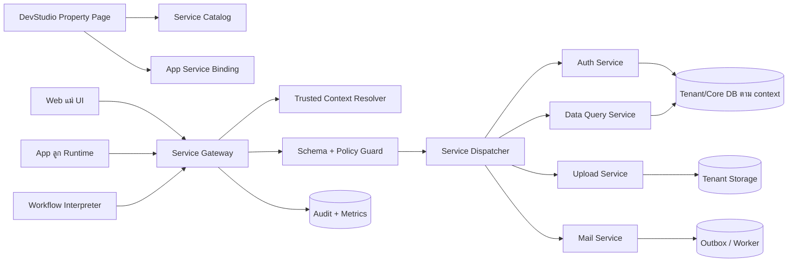
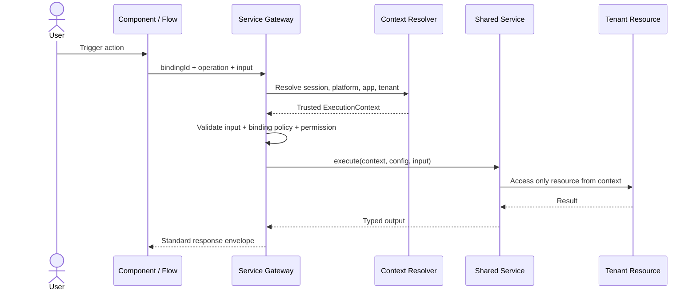

# Shared Backend Services สำหรับ Web แม่และ App ลูก

> สถานะ: Implemented MVP ครบ 5 Phase เมื่อ 2026-09-02; รายละเอียดไฟล์และข้อจำกัดอยู่ในหัวข้อ 17
>
> เป้าหมาย: Dev เลือก Service กลาง เช่น Auth, Query, Upload และ Send Mail แล้วกรอก Properties ของ App ตัวเอง โดยไม่ต้องคัดลอกหรือแตก Flow ภายในของ Service

## 1. คำตอบสั้นที่สุด

แนวคิดที่ควรใช้คือ **Backend Capability Hub**:

- Web แม่เป็นเจ้าของ implementation ของ Service พื้นฐานเพียงชุดเดียว
- Web แม่และ App ลูกเรียก Service ผ่าน contract เดียวกัน
- แต่ละ App สร้างเพียง **Service Binding** เพื่อกำหนด properties, policy และ secret reference ของตัวเอง
- Flow มีหน้าที่เรียงงานหลาย Service เข้าด้วยกัน ไม่ใช่เก็บขั้นตอนภายในของ Auth, Query, Upload หรือ Send Mail
- ทุก request ต้องได้ `tenantContext` จาก session/route ฝั่ง server ห้ามเชื่อ `appId`, database name, role หรือ storage path ที่ client ส่งมา

```text
Service Definition กลาง 1 ตัว
        │
        ├── Binding ของ Web แม่
        ├── Binding ของ App A
        └── Binding ของ App B

ทุก Binding ใช้ implementation เดียวกัน
แต่ config, policy, secret และข้อมูลแยกจากกัน
```

คำที่ช่วยคลายความสับสน:

- **Service** = ความสามารถและโค้ดกลางที่ทีม Platform ดูแล
- **Binding** = การเปิดใช้ Service นั้นใน App หนึ่ง พร้อม properties ของ App
- **Operation** = คำสั่งที่ Service เปิดให้เรียก เช่น `login`, `list`, `upload`, `sendTemplate`
- **Flow** = การนำหลาย operation มาเรียงเป็นกระบวนการธุรกิจ

## 2. ปัญหาที่แบบนี้แก้

ถ้าให้ทุก App แตก Flow ของ Auth, Query, Upload และ Mail เอง จะเกิดปัญหาเหล่านี้:

- logic ซ้ำหลายชุดและแก้ security bug ไม่พร้อมกัน
- Dev ต้องเข้าใจรายละเอียด JWT, SQL, path traversal, SMTP และ retry ทั้งที่ต้องการเพียงเรียกใช้
- การเปลี่ยน provider หรืออัปเกรด Service กระทบ Flow จำนวนมาก
- App อาจส่ง database, tenant ID, secret หรือ path ที่ไม่ควรให้ client ควบคุม
- ไม่รู้ว่า App ใดกำลังใช้ Service/version ใด และ audit ยาก

หลังใช้ Capability Hub งานของ Dev ควรเหลือเพียง:

1. เลือก Service จาก Catalog
2. กด `Use in this App`
3. กรอก Property Page
4. กด `Validate` และ `Publish`
5. bind operation เข้ากับ Component, Menu Action หรือ Flow Node

## 3. หลักการที่ต้องไม่สับสน

### 3.1 แชร์ implementation แต่ไม่แชร์ tenant data

Service กลางไม่ได้แปลว่าใช้ฐานข้อมูลหรือ user ชุดเดียวกันทั้งหมด

| สิ่งที่แชร์ | สิ่งที่ต้องแยกต่อ App/Platform |
|---|---|
| handler และ business-safe adapter | tenant database และ rows |
| input/output contract | users, roles และ sessions |
| validation และ error format | storage namespace |
| security patch และ version | provider credentials / secret reference |
| logging format | quota, allowlist และ permission policy |

Auth ของ Web แม่และ Auth ของ App ลูกจึงใช้ engine/contract ร่วมกันได้ แต่ต้องอยู่คนละ security realm:

- Web แม่ยืนยันตัวตนผู้ดูแล Platform จาก Core DB
- App ลูกยืนยันตัวตน end-user จาก Tenant DB ของ App นั้น
- token/cookie ต้องมี issuer, audience, subject และ tenant claim ที่ตรวจแยกกัน
- session ของ App A ใช้กับ App B หรือ Web แม่ไม่ได้

### 3.2 Property ไม่ใช่ Flow

Property คือค่าประกอบการทำงาน เช่น:

- อายุ session
- Collection ที่อนุญาตให้ query
- MIME type และขนาดไฟล์
- sender profile และ mail template

Flow คือกฎธุรกิจ เช่น:

```text
เมื่อส่งแบบฟอร์มร้องเรียนสำเร็จ
  → Upload หลักฐาน
  → Create complaint
  → Send acknowledgement email
```

Flow เห็นเพียง operation ข้างบน ไม่เห็นขั้นตอน hash password, ประกอบ SQL, sanitize filename, ต่อ SMTP หรือ retry ภายใน

### 3.3 Component ไม่เรียก URL เอง

Component และ Menu ควรอ้าง `bindingId + operation` แทนการเก็บ URL:

```json
{
  "type": "runService",
  "bindingId": "app.auth",
  "operation": "login",
  "input": {
    "email": "{{form.email}}",
    "password": "{{form.password}}"
  }
}
```

Runtime เป็นผู้ resolve endpoint, inject context, แนบ CSRF/session, validate schema และแปลงผลลัพธ์กลับให้ Component

## 4. สถาปัตยกรรมเป้าหมาย



### 4.1 Control Plane และ Data Plane

แยกความรับผิดชอบเป็นสองฝั่ง:

| Plane | หน้าที่ | ตัวอย่าง |
|---|---|---|
| Control Plane | ออกแบบ, bind, validate, publish, pin version | `/studio`, Service Catalog, Property Page |
| Data Plane | รับ request ตอน runtime, ตรวจ context/policy และ execute | Service Gateway, handler, queue, audit |

การแก้ draft ใน Studio ต้องไม่เปลี่ยน runtime ทันที จนกว่าจะ publish snapshot สำเร็จ

### 4.2 ลำดับการเรียก Service



## 5. Model กลาง

### 5.1 Service Definition: Platform เป็นเจ้าของ

Definition เป็น catalog แบบ read-only สำหรับ App Dev และเปลี่ยนด้วย release ของ Platform เท่านั้น

```ts
type ServiceKind = "auth" | "data" | "storage" | "notification";

interface ServiceDefinition {
  serviceKey: string;              // auth.session, data.collection, ...
  displayName: string;
  kind: ServiceKind;
  version: string;                 // semantic version เช่น 1.2.0
  implementationModule: string;    // server-only module
  lifecycle: "active" | "deprecated" | "retired";
  operations: Record<string, OperationDefinition>;
  propertySchema: JsonSchema;      // สร้าง Property Page อัตโนมัติ
  defaultConfig: Record<string, unknown>;
  capabilities: string[];
}

interface OperationDefinition {
  inputSchema: JsonSchema;
  outputSchema: JsonSchema;
  requiredPermission?: string;
  execution: "sync" | "async";
  idempotency: "none" | "supported" | "required";
  audit: "metadata" | "full-with-redaction";
}
```

### 5.2 Service Binding: App เป็นเจ้าของ

Binding เก็บเฉพาะความแตกต่างของ App ไม่คัดลอก definition หรือ implementation

```ts
interface AppServiceBinding {
  id: string;                       // app.auth, app.records, app.files
  appId: string;
  serviceRef: {
    serviceKey: string;
    versionRange: string;           // เริ่มต้นให้ pin major เช่น ^1.2.0
  };
  enabled: boolean;
  displayName?: string;
  config: Record<string, unknown>;  // non-secret properties
  secretRefs: Record<string, string>;
  policy: {
    allowedOperations: string[];
    requiredPermissions?: Record<string, string[]>;
    rateLimit?: { requests: number; windowSeconds: number };
  };
  status: "draft" | "valid" | "invalid" | "published";
}
```

กฎสำคัญ:

- `config` ต้องผ่าน `propertySchema`
- secret เก็บเป็น reference เท่านั้น เช่น `secret://platform/{id}/smtp-primary`
- runtime snapshot เก็บ resolved service version แต่ไม่เก็บ secret value
- App หนึ่งมีหลาย binding จาก definition เดียวได้ เช่น Mail ภายในและ Mail ประชาชน
- ลบ definition ที่ยังมี binding ไม่ได้; ต้อง deprecate และ migrate ก่อน

### 5.3 Trusted Execution Context

Context นี้สร้างฝั่ง server เท่านั้น:

```ts
interface ServiceExecutionContext {
  requestId: string;
  traceId: string;
  actor: {
    type: "platform-user" | "tenant-user" | "system";
    userId?: string;
    roles: string[];
    permissions: string[];
  };
  scope: {
    platformId: string;
    appId?: string;
    tenantId: string;
    authRealm: "platform" | "tenant";
  };
  publishedRevision: string;
}
```

ค่าที่ห้ามรับจาก Property หรือ input ของ Component:

- database name / connection string
- absolute storage path
- tenant ID ที่จะนำไป query โดยตรง
- JWT/SMTP/API secret
- roles/permissions ของผู้เรียก
- implementation module หรือ arbitrary endpoint URL

## 6. Service Catalog ชุดแรก

### 6.1 Auth Service

```text
Service: auth.session
Operations: login, logout, me, refresh, changePassword
```

Properties ที่ App กำหนดได้:

| Property | ตัวอย่าง | หมายเหตุ |
|---|---|---|
| `identityField` | `email` | เลือกจาก field ที่ระบบรองรับ |
| `accessTtlSeconds` | `900` | อยู่ในช่วงที่ Platform อนุญาต |
| `refreshTtlSeconds` | `604800` | อยู่ในช่วงที่ Platform อนุญาต |
| `loginPageId` | `auth.login` | หน้า UI ของ App |
| `successRouteId` | `route.admin` | route หลัง login |
| `requiredStatus` | `active` | สถานะ user ที่เข้าได้ |

Platform เป็นผู้คุม algorithm, password hashing, signing key, cookie flags, brute-force protection และ token verification ห้ามเปิดสิ่งเหล่านี้เป็น free-form property

ข้อเสนอสำหรับ runtime จริงคือใช้ `HttpOnly + Secure + SameSite` cookie แทนการเก็บ access token ใน `sessionStorage` เพื่อไม่ให้ JavaScript อ่าน token ได้

### 6.2 Data Query Service

```text
Service: data.collection
Operations: list, get, create, update, delete, count
```

คำว่า Query ใน App Runtime ควรหมายถึง **structured collection query** ไม่ใช่ raw SQL:

```json
{
  "filter": [
    { "field": "status", "op": "eq", "value": "OPEN" }
  ],
  "sort": [{ "field": "created_at", "direction": "desc" }],
  "page": { "limit": 20, "cursor": null },
  "select": ["id", "title", "status", "created_at"]
}
```

Properties ของ Binding:

| Property | ตัวอย่าง |
|---|---|
| `collectionId` | `cms.complaint.collection` |
| `allowedOperations` | `list`, `get`, `create` |
| `readableFields` | `id`, `title`, `status` |
| `writableFields` | `title`, `description` |
| `allowedFilters` | `status:eq`, `created_at:gte` |
| `defaultSort` | `created_at desc` |
| `maxPageSize` | `100` |
| `rowPolicy` | policy reference ที่ compile โดย Platform |

Service เป็นผู้ compile parameterized SQL และบังคับ allowlist ทุก field/operator

Raw SQL Console ที่มีอยู่ควรคงเป็นเครื่องมือของผู้ดูแลใน Control Plane เท่านั้น ไม่ใช่ operation ที่ Component หรือ App ลูกเรียกได้

### 6.3 Upload Service

```text
Service: storage.object
Operations: upload, list, getMetadata, delete
```

Properties ของ Binding:

| Property | ตัวอย่าง |
|---|---|
| `rootNamespace` | `complaints/evidence` |
| `allowedMimeTypes` | `image/jpeg`, `image/png`, `application/pdf` |
| `maxFileBytes` | `10485760` |
| `maxFilesPerRequest` | `5` |
| `visibility` | `private` |
| `virusScanRequired` | `true` |
| `retentionDays` | `365` |

Service ต้อง resolve root จาก tenant context, sanitize ชื่อไฟล์, block executable content, ตรวจ MIME จาก bytes, จำกัดขนาด, สร้าง checksum และ audit ผู้ upload

input ห้ามมี absolute path และ output ของไฟล์ private ควรเป็น asset ID หรือ URL อายุสั้น ไม่ใช่ path บนเครื่อง

### 6.4 Send Mail Service

```text
Service: notification.email
Operations: sendTemplate, getDeliveryStatus
Execution: async
```

Properties ของ Binding:

| Property | ตัวอย่าง |
|---|---|
| `providerProfileRef` | `smtp-primary` |
| `fromName` | `องค์การบริหารส่วนตำบล` |
| `fromAddress` | `noreply@example.go.th` |
| `allowedTemplateIds` | `complaint-received`, `reset-password` |
| `allowedRecipientMode` | `user`, `field`, `fixed-domain` |
| `replyTo` | `support@example.go.th` |
| `dailyQuota` | `5000` |

Flow ส่งเพียง template ID, recipient ตาม policy และ template variables:

```json
{
  "bindingId": "app.public-mail",
  "operation": "sendTemplate",
  "input": {
    "templateId": "complaint-received",
    "to": "{{record.email}}",
    "variables": {
      "ticketNo": "{{record.ticket_no}}",
      "displayName": "{{record.display_name}}"
    }
  }
}
```

SMTP password/API key อยู่ใน Secret Store เท่านั้น และการส่งต้องผ่าน Outbox/Queue เพื่อ retry, deduplicate และไม่ทำให้ request หลักค้าง

## 7. Gateway Contract เดียว

เสนอ canonical runtime route:

```http
POST /api/runtime/{appSlug}/services/{bindingId}/{operation}
Content-Type: application/json
Idempotency-Key: optional-or-required-by-operation
X-Request-Id: optional
```

Web แม่ใช้ dispatcher เดียวกันผ่าน platform scope ไม่ควรเรียก route ของ App ลูก:

```http
POST /api/platform-runtime/services/{bindingId}/{operation}
```

ทั้งสอง route ต้องเข้า pipeline เดียวกันหลัง resolve context แล้ว

### Response envelope

สำเร็จ:

```json
{
  "ok": true,
  "data": {},
  "meta": {
    "requestId": "req_...",
    "service": "data.collection",
    "version": "1.2.0"
  }
}
```

ผิดพลาด:

```json
{
  "ok": false,
  "error": {
    "code": "SERVICE_INPUT_INVALID",
    "message": "ข้อมูลที่ส่งมาไม่ถูกต้อง",
    "fieldErrors": { "email": "required" },
    "retryable": false
  },
  "meta": { "requestId": "req_..." }
}
```

error code ขั้นต่ำ:

- `SERVICE_NOT_FOUND`
- `BINDING_DISABLED`
- `OPERATION_NOT_ALLOWED`
- `SERVICE_INPUT_INVALID`
- `AUTH_REQUIRED`
- `PERMISSION_DENIED`
- `RATE_LIMITED`
- `TENANT_RESOURCE_UNAVAILABLE`
- `PROVIDER_TEMPORARY_FAILURE`
- `SERVICE_VERSION_UNAVAILABLE`

ห้ามส่ง stack trace, SQL, filesystem path หรือ provider secret กลับ client

## 8. การใช้กับ Component และ Flow

### 8.1 Direct Binding

ใช้เมื่อมี operation เดียวและผลลัพธ์ตรงไปตรงมา:

```text
Login Form ── app.auth.login
Data Table ── app.news.list
File Input ── app.attachments.upload
```

### 8.2 Workflow Binding

ใช้เมื่อเป็น business process หลายขั้น:

```json
{
  "id": "node.notify-owner",
  "type": "serviceCall",
  "bindingId": "app.public-mail",
  "operation": "sendTemplate",
  "inputMapping": {
    "templateId": "complaint-received",
    "to": "$.record.email",
    "variables.ticketNo": "$.record.ticket_no"
  },
  "saveResultAs": "$.mailJob",
  "onError": "node.record-mail-error"
}
```

กติกา:

- ไม่มี node ชื่อ `Connect SMTP`, `Build SQL`, `Sign JWT` หรือ `Write File`
- Flow อ้าง binding ไม่อ้าง secret/provider/implementation
- input/output mapping ต้อง validate กับ schema ตอน publish
- operation ที่เปลี่ยนข้อมูลควรรองรับ idempotency
- retry อยู่ใน Service สำหรับ technical failure; Flow จัดการเฉพาะ business outcome

## 9. หน้าจอใน DevStudio

โครงสร้าง Treeview ที่แนะนำ:

```text
Backend Services
├── Auth
│   └── Tenant Login (app.auth)                  READY
├── Data
│   ├── Complaints (app.complaints)              READY
│   └── News (app.news)                          DRAFT
├── Storage
│   └── Complaint Evidence (app.attachments)     INVALID
└── Notification
    └── Public Mail (app.public-mail)             READY
```

เมื่อกด Service Binding ให้เปิด Property Page 5 แท็บ:

1. **General** — ชื่อ, enabled, service version
2. **Properties** — form ที่สร้างจาก `propertySchema`
3. **Operations & Permissions** — operation ที่เปิดและ permission ต่อ operation
4. **Secrets** — เลือก secret reference; แสดงสถานะ ไม่แสดงค่า
5. **Usage & Test** — Component/Flow ที่ใช้อยู่, test ด้วย sample input, audit ล่าสุด

ปุ่มหลัก:

- `Use in this App`
- `Validate Configuration`
- `Test Operation`
- `Publish Binding`
- `View Dependencies`
- `Upgrade Version`

สถานะต้องแยกให้ชัด:

```text
NOT_CONFIGURED → DRAFT → INVALID/VALID → PUBLISHED → DEPRECATED
```

## 10. Publish และ Versioning

ขั้น publish ที่ถูกต้อง:

1. resolve `serviceRef` เป็น version จริง
2. validate config ด้วย schema ของ version นั้น
3. ตรวจว่า secret refs มีอยู่และ App มีสิทธิ์ใช้
4. validate operation permissions
5. ตรวจ references จาก Component/Flow
6. สร้าง immutable runtime snapshot
7. activate revision ใหม่แบบ atomic
8. เขียน audit log

การอัปเกรด:

- patch/minor อัปได้เมื่อ contract backward compatible
- major ต้องสร้าง draft migration และให้ Dev ยืนยัน
- published revision เก่ายัง rollback ได้
- ห้ามแก้ definition version เดิมย้อนหลัง
- Service ที่ deprecated ต้องแสดง deadline และ replacement

## 11. Security และ Operations Checklist

ทุก Service ต้องมี:

- tenant isolation จาก trusted context
- input/output schema validation
- operation allowlist และ permission check
- rate limit/quota แยก App และ actor
- timeout, payload limit และ concurrency limit
- structured audit พร้อม redaction password/token/secret/PII
- correlation ด้วย request ID และ trace ID
- idempotency/deduplication สำหรับ write และ async operation
- health/status โดยไม่เปิดข้อมูลลับ
- metrics: latency, success/error rate, queue lag และ usage ต่อ binding

สำหรับ log ให้บันทึกอย่างน้อย:

```text
timestamp, requestId, traceId, actorId, platformId, appId,
bindingId, serviceKey, version, operation, outcome, durationMs
```

ไม่ควร log password, access token, SMTP credential, raw file content หรือ mail body ที่มีข้อมูลส่วนบุคคล

## 12. การจัดเก็บข้อมูล

### ระยะเริ่มต้น

ระบบปัจจุบันมี `platforms.studio_services JSONB` อยู่แล้ว จึงใช้เป็น draft storage ชั่วคราวได้ โดยปรับ shape ให้แยก `definition` และ `binding` ชัดเจน และ compile ลง `runtime_snapshot` ตอน publish

### ระยะที่ระบบโต

แนะนำ normalize เป็น:

```text
service_definitions
service_definition_versions
app_service_bindings
app_service_binding_revisions
service_secret_references
service_invocation_audit
service_idempotency_keys
service_outbox_jobs
```

เหตุผลคือค้น dependency, บังคับ uniqueness, upgrade version, audit และ rollback ได้ง่ายกว่า JSONB ก้อนเดียว

## 13. สภาพโค้ดปัจจุบันและช่องว่าง

สิ่งที่มีอยู่แล้ว:

- `StudioServiceDefinition` และ `createDefaultJwtAuthService()`
- `platforms.studio_services`
- Auth bundle สำหรับ Login/Admin/Users/Roles/Permissions
- runtime login route ของ App ตาม slug
- tenant-aware file storage และ File Manager
- read-only SQL Console สำหรับผู้ดูแล Platform
- `runService` action และ Workflow Interpreter

สิ่งที่ต้องเปลี่ยน:

| ปัจจุบัน | เป้าหมาย |
|---|---|
| `StudioServiceDefinition` รองรับเฉพาะ `kind: auth` และ `provider: jwt` | generic Definition + App Binding |
| runtime hard-code `service.auth.jwt` และ action `auth.login.submit` | generic `bindingId + operation` dispatcher |
| `runService` ถูกตีความเป็น workflow trigger | แยก `serviceCall` ออกจาก `workflowTrigger` |
| Component บางส่วนเรียก API URL โดยตรง | อ้าง Service Binding เป็นหลัก |
| token ของ App ลูกอยู่ใน `sessionStorage` | server-managed HttpOnly cookie |
| File Manager เป็น API เฉพาะ | adapter ใต้ `storage.object` |
| ยังไม่มี mail provider/queue | `notification.email` + outbox worker |
| Query Console รับ SQL จากผู้ดูแล | runtime ใช้ structured collection query เท่านั้น |

## 14. แผนลงมือทำที่เสี่ยงต่ำ

### Phase 1 — Contract และ Catalog

- สร้าง generic types: Definition, Operation, Binding, ExecutionContext
- สร้าง catalog registry แบบ server-only
- ทำ property schema และ validation
- migrate Auth เดิมให้เป็น `auth.session@1`

### Phase 2 — Generic Gateway

- เพิ่ม dispatcher และ standard response envelope
- ทำ context resolver, policy guard, audit และ rate limit กลาง
- เปลี่ยน Login ให้เรียก gateway โดย behavior เดิมยังใช้ได้

### Phase 3 — Data และ Storage Adapter

- สร้าง structured collection query
- ครอบ File Manager ด้วย `storage.object`
- เพิ่ม direct binding ใน Form/Table/File Component

### Phase 4 — Mail และ Async Worker

- เพิ่ม Secret Store abstraction
- เพิ่ม mail template registry, outbox, retry และ delivery status
- รองรับ idempotency key

### Phase 5 — Flow และ Studio UX

- เพิ่ม `serviceCall` node ที่เลือก binding/operation จาก dropdown
- สร้าง Property Page จาก schema
- dependency viewer, test console, version upgrade และ publish validation

## 15. Acceptance Criteria

ถือว่าแนวคิดนี้สำเร็จเมื่อ:

- Dev สร้าง App ใหม่แล้วเปิด Auth ได้โดยไม่วาด Auth Flow
- App สองตัวใช้ Auth implementation version เดียวกัน แต่ user/session ข้ามกันไม่ได้
- Table query ข้อมูลได้ด้วย Collection Binding โดยไม่มี raw SQL ใน Page/Flow
- Upload ไม่สามารถออกนอก tenant namespace แม้แก้ request ด้วยตนเอง
- Mail Flow ระบุเพียง template/recipient/variables และไม่เห็น SMTP secret
- เปลี่ยน provider หรือ patch security ที่ Service กลางได้โดยไม่แก้ทุก Flow
- publish ถูกปฏิเสธทันทีหาก property, permission, secret ref หรือ mapping ไม่ถูกต้อง
- ทุก invocation ตามกลับได้จาก request ID โดย log ไม่มี secret
- rollback runtime snapshot แล้ว Binding และ version กลับมาชุดเดิมแบบ atomic

## 16. ข้อสรุปการตัดสินใจ

ให้ยึดประโยคนี้เป็นกฎกลางของทีม:

> **Service ทำงานพื้นฐานให้เสร็จในตัวเอง, Binding บอกว่า App นี้จะใช้ Service อย่างไร, และ Flow บอกว่าจะเรียก Service ใดก่อนหรือหลังเท่านั้น**

ดังนั้น Auth, Query, Upload และ Send Mail ไม่ควรถูกแตกเป็น Flow ให้ทุก App แก้ภายใน แต่ควรเป็น versioned backend services ของ Web แม่ที่ทั้ง Web แม่และ App ลูกเรียกผ่าน Gateway เดียวกัน ภายใต้ context, config และ policy ที่แยกต่อ App อย่างเข้มงวด

## 17. Implementation Status

ทั้ง 5 Phase มี working implementation แล้ว:

| Phase | สถานะ | Implementation หลัก |
|---|---|---|
| 1 — Contract และ Catalog | เสร็จ | `src/lib/services/catalog.ts`, `bindings.ts`, `schemaValidator.ts` และ generic types ใน `src/types/index.ts` |
| 2 — Generic Gateway | เสร็จ | runtime/platform gateway, trusted context, response envelope, permission, audit และ idempotency |
| 3 — Data และ Storage | เสร็จ | structured collection query, tenant-aware object storage และ Component service binding properties |
| 4 — Mail และ Worker | เสร็จ | template allowlist, quota, outbox, exponential retry, delivery status และ HTTP provider worker |
| 5 — Flow และ Studio UX | เสร็จ | Shared Services tab, schema-driven Property editor, App overrides, Menu binding, `serviceCall` node และ publish validation |

Runtime routes ที่เพิ่ม:

```text
POST /api/runtime/{slug}/services/{bindingId}/{operation}
POST /api/platform-runtime/services/{bindingId}/{operation}?platformId={id}
GET  /api/service-catalog
GET  /api/apps/{id}/service-bindings
PUT  /api/apps/{id}/service-bindings
POST /api/platforms/{id}/service-bindings/validate
POST /api/internal/service-outbox
```

Migration `026_create_shared_services.sql` สร้าง catalog, normalized App bindings, invocation audit, idempotency keys และ email outbox โดย migration ถูกทดสอบกับ Core DB ที่กำลังรันแล้ว

ข้อจำกัดของ MVP:

- Email worker ใช้ HTTP email provider contract กลาง ต้องกำหนด `MAIL_PROVIDER_ENDPOINT`, `MAIL_PROVIDER_TOKEN`, `SERVICE_WORKER_SECRET` และเรียก worker endpoint จาก scheduler ของ deployment
- Published Platform bindings ยังมี `platforms.studio_services` เป็น authoring source เพื่อรักษา compatibility; ตอน publish จะ sync ลงตาราง normalized
- Component รุ่นเดิมยังเรียก API เดิมได้ในช่วง migration ส่วน Component/Flow ใหม่ควรใช้ `service:bindingId:operation` หรือ `serviceCall`
- Auth login alias เดิมยังอยู่ แต่ส่งงานต่อเข้า dispatcher กลางและตั้ง HttpOnly cookie แยกชื่อ per App แล้ว
