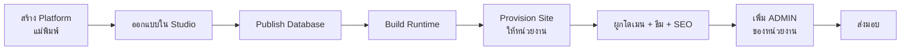

# คู่มือ GOD — ผู้ให้บริการ (หนุมานไอที)

สิทธิ์สูงสุดของระบบ เข้าถึงทุก Platform และทุกเว็บไซต์

---

## 1. เปิดเว็บให้หน่วยงานใหม่



### ขั้นที่ 1 — สร้าง Platform (ทำครั้งเดียวต่อประเภทเว็บ)

`/admin/platforms` → **Create Platform**

| ช่อง | คำอธิบาย |
|---|---|
| ชื่อ Platform | เช่น "เว็บ อบต." |
| Slug | ตัวพิมพ์เล็ก a–z, 0–9 และขีดกลาง แก้ภายหลังไม่ได้ |
| Category | หมวดหมู่ กดเพิ่มใหม่ได้ถ้าไม่มี |
| **First Public Page** | กำหนดหน้าแรกและโครงสร้างสิทธิ์ตั้งแต่ต้น |

**First Public Page เลือกอย่างไร**

| ค่า | เหมาะกับ | ได้อะไร |
|---|---|---|
| `PUBLIC_HOME` | เว็บประชาสัมพันธ์ล้วน | หน้าแรกสาธารณะ ไม่มีระบบล็อกอิน |
| `PUBLIC_HOME_WITH_LOGIN` | เว็บหน่วยงานทั่วไป | หน้าแรกสาธารณะ + ปุ่มเข้าสู่ระบบ + พื้นที่ภายใน |
| `LOGIN_PAGE` | ระบบภายใน | เปิดมาเจอหน้าล็อกอินเลย |

> เลือกแล้วเปลี่ยนทีหลังยาก เพราะกำหนดว่าจะสร้าง Module `AUTH` และหน้า Private ให้หรือไม่
> ถ้าไม่แน่ใจให้เลือก `PUBLIC_HOME_WITH_LOGIN`

ระบบจะสร้าง Module, หน้า และ Flow เริ่มต้นให้ใน**คำสั่งเดียว** ถ้าพลาดขั้นใดจะยกเลิกทั้งหมด
ไม่มีสภาพสร้างค้างครึ่งทาง

### ขั้นที่ 2 — ออกแบบใน Studio

`/studio` → เลือก Platform

- ลากวาง component จาก Palette
- **Tenant Database → Schema Explorer** สร้างตาราง/ฟอร์มผูกกับตารางจริงได้ในคลิกเดียว
- กด **Save** ทุกครั้งที่แก้เสร็จ

### ขั้นที่ 3–4 — Publish และ Build

| ปุ่ม | ทำอะไร | ต้องกดเมื่อ |
|---|---|---|
| **Publish Database** | สร้างตารางในฐานข้อมูลของ Platform | แก้โครงสร้างข้อมูล |
| **Build Runtime** | สร้าง snapshot ที่เว็บจริงจะใช้ | แก้หน้าเว็บแล้วอยากให้ขึ้นจริง |

> แก้ใน Studio แล้ว **เว็บจริงยังไม่เปลี่ยนจนกว่าจะ Build Runtime**

### ขั้นที่ 5 — เปิดเว็บให้หน่วยงาน

`/admin/apps` → **Provision Tenant App**

ระบบจัดพอร์ตและสร้างฐานข้อมูลให้อัตโนมัติ ไม่ต้องกรอกเอง

### ขั้นที่ 6 — ตั้งค่าเว็บ

ในการ์ดของแต่ละเว็บ

| ปุ่ม | ใช้ทำอะไร |
|---|---|
| **จัดการโดเมน** | ผูกโดเมนจริง เช่น `www.example.go.th` (ผูกได้หลายโดเมน) |
| **ธีม** | เลือกชุดสี สีหลัก ความมนของมุม ฟอนต์ |
| **SEO** | ชื่อเว็บ คำอธิบาย รูปแชร์ Google Search Console |
| **Overrides** | ซ่อน component บางตัวเฉพาะเว็บนี้ |

**หลังเพิ่มหรือแก้โดเมนต้องรีสตาร์ท**

```bash
docker compose restart sites          # หรือ npm run sites
```

จากนั้นสร้าง nginx.conf ใหม่จากทะเบียนจริง

```bash
curl -s -b cookies.txt http://localhost:33000/api/nginx-config > docker/nginx/nginx.conf
docker compose restart nginx-proxy
```

### ขั้นที่ 7 — ส่งมอบให้หน่วยงาน

เพิ่มบัญชี **ADMIN** ให้หน่วยงานหนึ่งคน แล้วให้เขาเพิ่มคนอื่นเอง

---

## 2. แพ็กเกจและวันหมดอายุ

**เฉพาะ GOD เท่านั้น**ที่แก้ได้ ADMIN และ STAFF ดูได้อย่างเดียว

```
PUT /api/apps/{appId}/package
{ "packageName": "Professional", "expiresAt": "2027-12-31",
  "limits": { "maxUsers": 50, "maxDomains": 5, "maxStorageMb": 8192 } }
```

- `expiresAt: null` = ไม่มีวันหมดอายุ
- `isSuspended: true` + `suspendedReason` = ระงับเว็บพร้อมบอกเหตุผลให้หน่วยงานเห็น
- `maxUsers` ใช้จำกัดจำนวนผู้ใช้ที่ ADMIN เพิ่มได้

หน่วยงานจะเห็นสถานะที่ `/site/{slug}` และระบบเตือนอัตโนมัติเมื่อเหลือน้อยกว่า 30 วัน

---

## 3. ความปลอดภัย

`/admin/security` แสดง **สถานะจริง** ที่อ่านจากฐานข้อมูล ไม่ใช่ข้อความคงที่

### จำกัดอัตราการเรียกใช้งาน

ปรับได้ทันทีจากหน้านี้ ไม่ต้อง deploy

| นโยบาย | คุมอะไร |
|---|---|
| `platform_login` | ล็อกอินเว็บแม่ |
| `tenant_login` | ล็อกอินเว็บหน่วยงาน |
| `public_write` | ฟอร์มสาธารณะ เช่น ร้องเรียน |
| `public_read` | การดึงข้อมูลของผู้เข้าชม |

แต่ละนโยบายตั้งได้ 3 ค่า: จำนวนครั้งสูงสุด · ช่วงเวลานับ · ระยะเวลาล็อก
ด้านล่างมีรายการที่กำลังถูกล็อกพร้อมปุ่ม **ปลดล็อก** สำหรับกรณีผู้ใช้จริงโดนพลาด

> ตั้ง `ระยะเวลาล็อก = 0` ถ้าอยากนับแต่ไม่ล็อก · ปิดนโยบายไว้ = ไม่จำกัด

### ตารางที่เปิดสาธารณะ

ผู้เข้าชมที่ไม่ได้ล็อกอินอ่านหรือเขียนได้เฉพาะตารางที่ประกาศไว้ใน `public_data_access`
และ**เขียนได้อย่างเดียว แก้หรือลบไม่ได้เลย** ตรวจรายการได้ที่หน้านี้

---

## 4. ผู้ใช้ทั้งระบบ

`/admin/users` — เห็นทุกบัญชี

- **GOD** = พนักงานหนุมานไอที เข้าถึงทุกเว็บ
- **TENANT_USER** = คนของหน่วยงาน สิทธิ์จริงมาจากเว็บที่ถูกเพิ่มเข้าไป

ระบบไม่ยอมให้ลด GOD คนสุดท้ายหรือปิดบัญชีตัวเอง เพื่อไม่ให้ล็อกทุกคนออกจากระบบ

---

## 5. คำสั่งที่ใช้บ่อย

```bash
npm run secrets              # สร้าง/หมุน AUTH_SECRET และ PLATFORM_JWT_SECRET
npm run sites                # เปิดทุกเว็บ (production)
npm run sites:dev            # เปิดทุกเว็บ (development)
npm run sites:list           # ดูทะเบียนเว็บและพอร์ต
docker compose restart sites # โหลดโดเมนใหม่
```

> `npm run secrets -- --rotate` จะเปลี่ยน secret ใหม่ทั้งหมด
> **ทุกคนที่ล็อกอินค้างอยู่จะหลุดทันที** ใช้เมื่อสงสัยว่า secret รั่วเท่านั้น
